<style>
.reveal table {
  margin: auto;
  border-collapse: collapse;
  border-spacing: 0;
  background-color: #f1f1c1;
}

.reveal table th {
  font-weight: bold;
}

.reveal table th,
.reveal table td {
  text-align: left;
  font-size: 120%;
  padding: 0.2em 0.5em 0.2em 0.5em;
  border-bottom: 1px solid;
}

.reveal table tr:nth-child(even) {
    color: white;
    background-color: #f08a00;
}
.reveal table tr:nth-child(odd) {
    color: white;
    background-color: #7b0663;
}
.reveal table th {
    color: white;
    background-color: black;
}


</style>

<style type="text/css">
.reveal .slide h1 { font-size: 200%; text-decoration: underline; }

.reveal .slides .title {
  /* Ugly ... */
  text-shadow: 0px 0px 25px rgb(100,256,0); 
  font-size: 300%;
}

.reveal .slide h6 { font-size: 80%;}
</style>
<style>

.footer {
    color: black; background: white;
    position: fixed; top: 90%;
    text-align:left; width:100%;
}

</style>
<section class="slide level2" data-background="figs/ML_rainbow2.svg">

</section>


## {data-background="figs/title_page.png"}

<div style = "float:left; width:50%">

</div>
 
<div style = "float:right; width:50%">
<br><br><br><br><br><br><br><br><br>
<h3 class="fragment highlight-green">"Chinese translation | Bo Guan</h3>
<h3 class="fragment highlight-green">"`r Sys.Date()`" | C. L. Eng</h3>
<h3 class="fragment highlight-green">https://www.yammer.com/ericsson.com#/home | #machinelearning | @echieng</h3>
</div>

## 内容摘要 {data-background="figs/ML_rainbow1.svg"}

<div class='left' style='float:left;width:50%'>
-  背景
-  目标
-  学习任务
-  算法与模型
-  机器学习的处理过程
-  机器学习的基本要点
-  参考

</div>

# 背景


## 困难

<div class='left' style='float:left;width:50%'>
- <p class="fragment highlight-blue">数据质量  </p>
      * <h4>噪声，错误，偏差</h4>
- <p class="fragment highlight-green">特征工程</p>
      * <h4>描述输出的属性 </h4>
- 算法选择
      * <h4>受限于预期的输出和可用的数据 </h4>
</div>
<div class='right' style='float:right;width:50%'>
- 学习  
      * <h4>时间和基础设施 </h4> 
- 模型复杂性  
      * <h4>准确性，时间和复杂性 </h4>
- 超参数 
      * <h4>迭代搜索找到最优参数 </h4>
</div>


## 信息来源

<div  class="fragment" style='float:left;width:50%'>

- [机器学习简介 - 基于自动化的自动化]

- 开放源码 -  <br> 

- RStudio博客   

- MOOC (大规模开放在线课程)   


</div>

<div class="fragment" style='float:right;width:50%'>
- Databricks博客   

- 深度学习 - Goodfellow Ian, Bengio Yoshua, Courville Aaron   

- ++许多博客文章，新闻，意见，研究论文，白皮书，开源API库等将被引用在线 

</div>

# 目标


## 目标 {data-background="figs/ML_five.svg"}

<div  class="fragment" style='float:left;width:50%'>

<ul><li class="fragment">理解机器学习的过程</li><br>
<li class="fragment">知道数据的重要性</li><br>
<li class="fragment">创建学习模式的过程</li><br>
<li class="fragment">多维优化问题</li><br>
<li class="fragment">模型复杂性和评估</li><br></ul>  
</div>

<div class="fragment" style='float:right;width:50%'>


</div>


# 机器学习概要

## 通用过程

<center>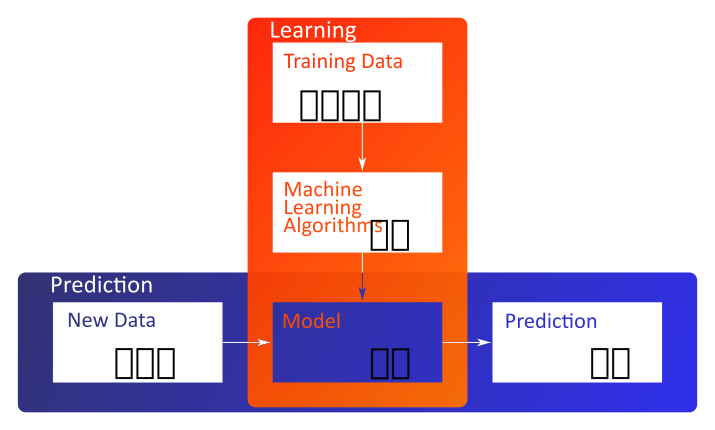
	</center>
<figcaption> <small>概要的机器学习和预测任务</small> </figcaption>

## 机器学习概念

<center>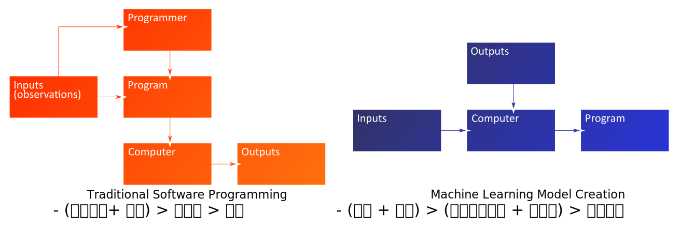</center>

<figcaption> <small>传统应用软件编程与机器学习模型创建的比较</small> </figcaption>

<h3><center> 自动化 </center></h3>
<center> 机器学习从数据推导出规则 </center>

<center> (自动化，隐式编程) </center>
	

# 基本学习任务

## 机器学习(ML)概要

<center>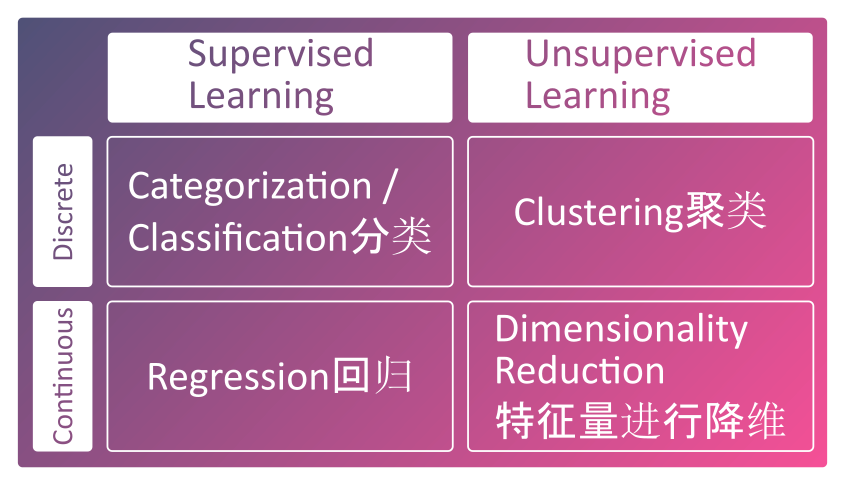</center>

<figcaption> <small>学习任务分类</small> </figcaption>

## 机器学习方法

<br>

学习方法      | 学习	
-------------: | ------------------------------------------------------------------------
监督    | 具有输入和预期输出的数据集 - 将输入映射到输出的目标
无监督  | 没有已知标签的数据集 - 目标是去发现模式或结构
强化 | 系统自动尝试了解情况，从互动中学习，并为自己的目标选择最佳路径
转让      | 通过将知识转移到已经学习的相关任务中，可以学到一个新任务


## 学习任务

<div style = "float:left; width:35%">
 
<right>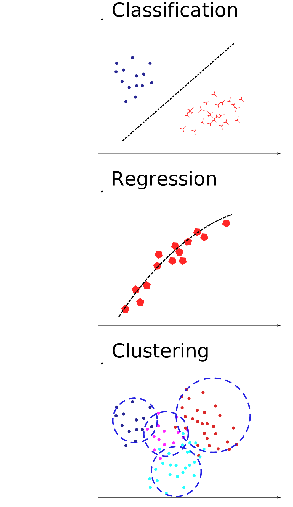</right>
<figcaption><small>学习任务分类</small></figcaption><br>

</div>
 
<div style = "float:right; width:65%">

任务            | 描述
--------------- | -----------------------------------------------------------------------------------------------------------------------
<br> 分类  | - 多类或者二元分类  <br> - 排名 <br> - 评估：曲线下的分类误差或者面积area under the curve (AUC)
<br> 回归      | - 预测一个真实值的结果 <br> <br>- 高斯(Gaussian), 泊松(Poisson), Gamma etc 分布 <br> <br> - 评估方法：均方误差  
<br> 聚类      | - 无监督学习 (没有训练标记)  <br> - 划分数据；识别群和子群  <br> - 评估：总平方和，贝叶斯信息准则Bayesian information criterion (BIC)
<br><br>
</div>


## 学习任务（二进制分类）

<div style = "float:left; width:60%">
 
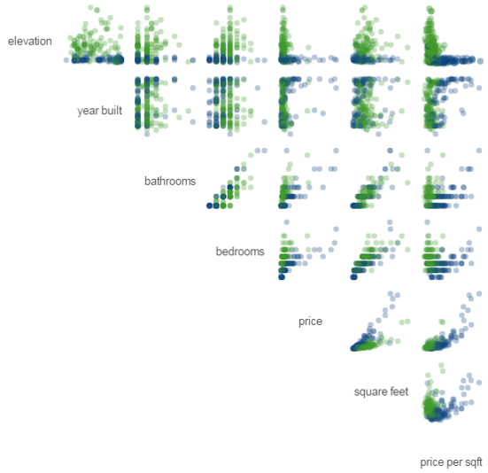
<figcaption> <small>二进制分类示例：根据可用的特征来预测给定的房屋是否位于纽约市或旧金山</small> </figcaption>
</div>
 
<div style = "float:right; width:40%">
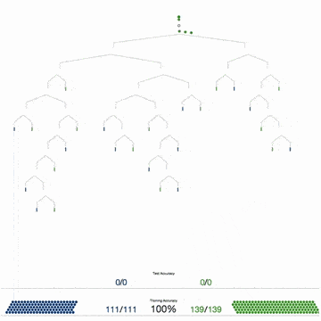
<small>credit: http://www.r2d3.us/visual-intro-to-machine-learning-part-1/^[Visualising Machine Learning; http://www.r2d3.us/visual-intro-to-machine-learning-part-1]</small>
</div>


## 学习任务 – 案例（M级分类）

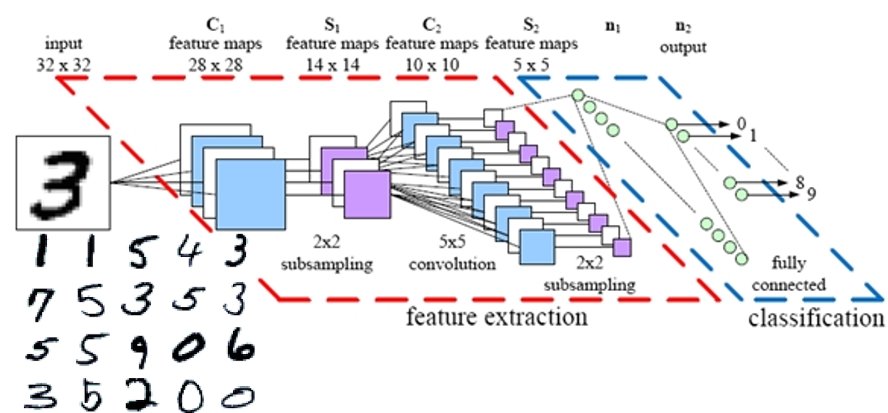

<figcaption> <small>多类分类示例：预测给定的手写数字值</small> </figcaption>
<small>归功于: AT&T 研究^[AT&T 研究] </small>
<br>

<a href="http://scs.ryerson.ca/~aharley/vis/conv/" data-preview-link>- 可视化卷积神经网络在行动 ^[Convolution Neural Networks Viz http://scs.ryerson.ca/~aharley/vis/conv/]

</a>


## 人工智能系统

<div style = "float:left; width:65%">
 
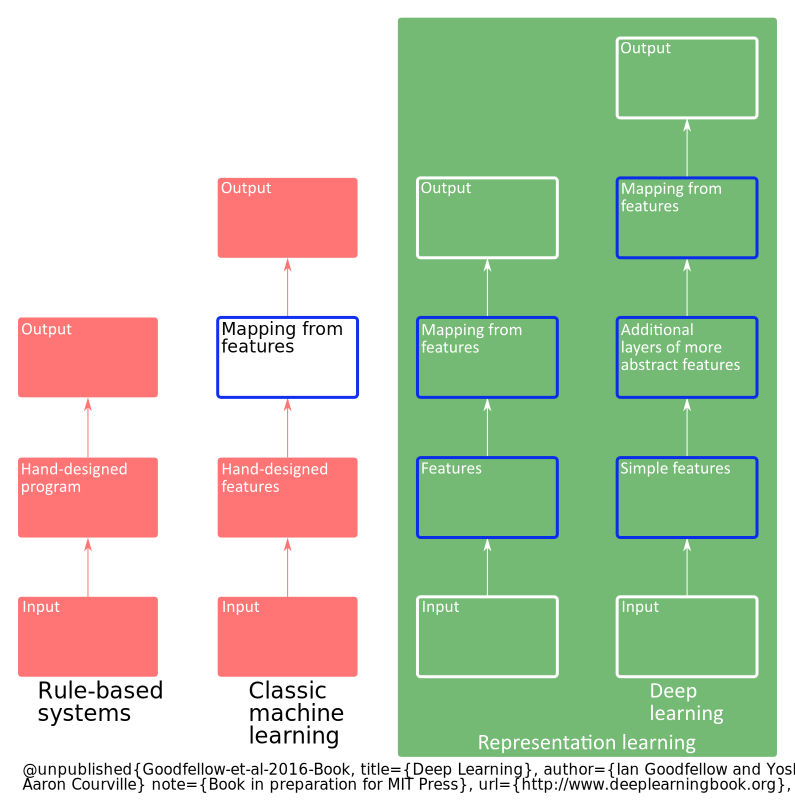
<figcaption></figcaption><br>

</div>
 
<div style = "float:right; width:35%">

<h6>- AI系统的不同部分在不同的AI学科之间相互关联</h6>
<h6>- 蓝色框表示能够从数据中学习的组件</h6>


<small>
<small>@unpublished{Goodfellow-et-al-2016-Book, title={Deep Learning}, author={Ian Goodfellow and Yoshua Bengio and Aaron Courville} note={Book in preparation for MIT Press}, url={http://www.deeplearningbook.org}, year={2016} } ^[Deep Learning; Ian Goodfellow and Yoshua Bengio and Aaron Courville]</small>
</small>
</div>


## 人工神经网络

<center>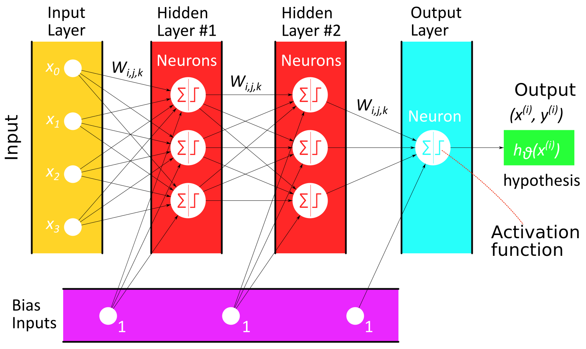
<figcaption> <small>人工神经网络结构和术语</small> </figcaption></center>

<small> 输入层, 隐藏层, 输出层, 神经网络之激活函数 </small>


# 算法与模型

## 算法 - 算法类别

<div style = "float:left; width:99%">
 
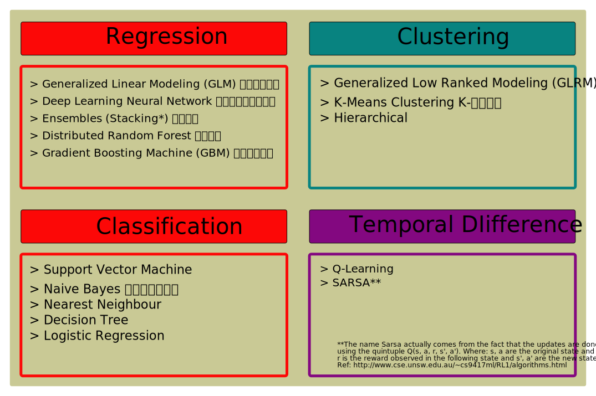
<figcaption><small>算法类别</small></figcaption>

</div>


## 从数据中学习

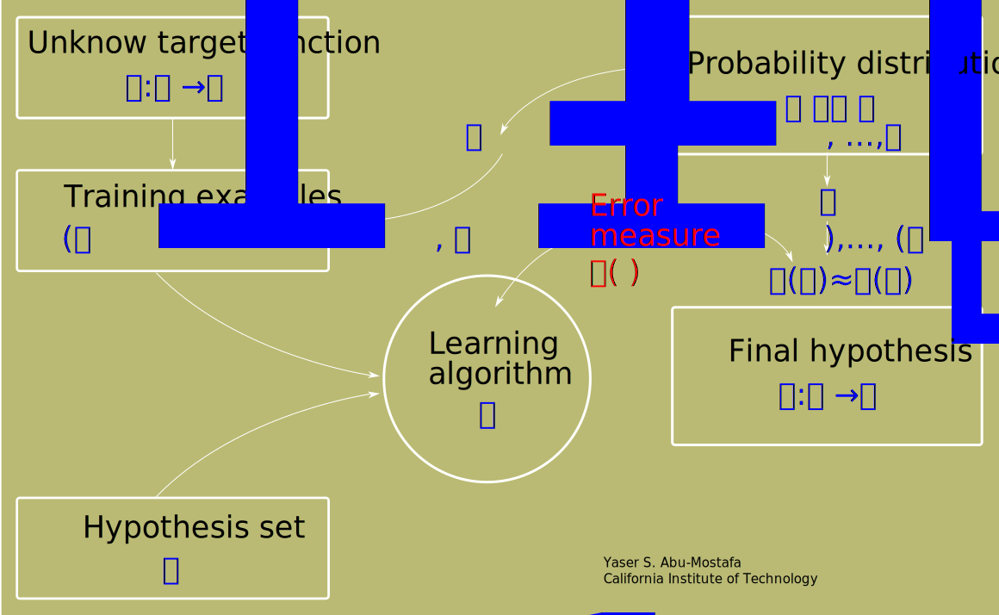<br><figcaption> <small>常规算法学习^[Yaser S. Abu-Mostafa; 加州理工学院]</small> </figcaption>

## 学习模型

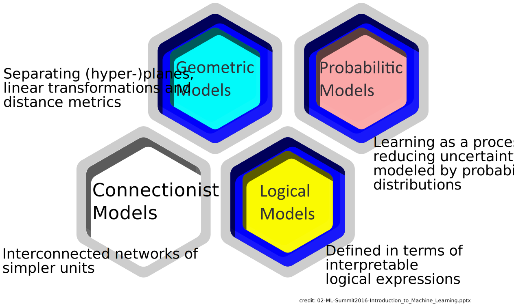
<figcaption> <small>学习模型类别</small> </figcaption>

## 学习任务和算法

```{r echo = FALSE, error = FALSE, message = FALSE, warning = FALSE}

library(plotly)
library(ggplot2)

df_ml_cla <- read.csv("f:/Data/Machine_Learning/workshop/ML_difficult_2d_data.csv")
df_ml_cla <- data.frame(x=c(1,2,2,3), y=c(1,2,3,4),value=c(1:4), algo=c("K-means, <br>PCA, <br>Neural Networks, <br>Hierarchical", "Support Vector Machine, <br>Naive Bayes, <br>Nearest Neighbour, <br> Decision Trees", "Linear Regression GLM, <br> Decision Trees, <br> Neural Networks, <br> Ensemble Method","Q(off-policy), <br>SARSA(on-policy)"))

df_ml_cla$x[which(df_ml_cla$x == 1)] <- 'Unsupervised'
df_ml_cla$x[which(df_ml_cla$x == 2)] <- 'Supervised'
df_ml_cla$x[which(df_ml_cla$x == 3)] <- 'Reinforcement'
df_ml_cla$x <- as.factor(df_ml_cla$x)

df_ml_cla$y[which(df_ml_cla$y == 1)] <- 'Clustering'
df_ml_cla$y[which(df_ml_cla$y == 2)] <- 'Classification'
df_ml_cla$y[which(df_ml_cla$y == 3)] <- 'Regression'
df_ml_cla$y[which(df_ml_cla$y == 4)] <- 'Temporal Difference'
df_ml_cla$y <- as.factor(df_ml_cla$y)

font1 <- list(
  family = "Courier New, monospace",
  size = 24,
  color = "#7f7f7f"
)

font2 <- list(
  size = 18,
  color = "#7f7f7f"
)
xlabel <- list(
  title = "Learning Technique",
  titlefont = font1,
  tickfont = font2
)
ylabel <- list(
  title = "Algorithm Category",
  titlefont = font1,
  tickfont = font2
)
m <- list(l=350, r=50, b=50, t=10, pad=4)

p2d_cla <- plot_ly(df_ml_cla, x = ~x, y = ~y, color = ~x, colors = c('#BF382A', '#0C4B8E'),
  text = ~paste(algo)) %>%  add_markers(sizes=c(30,30), size=10) %>%
  layout(xaxis = xlabel, yaxis = ylabel, autosize = F, width = 1000, height = 600, margin = m, legend = list(x = 100, y = 0.5))

p2d_cla
```


## 算法库

- 开源 (Open Source)

- H2O.ai - Python, R
<a href="http://www.h2o.ai/" data-preview-link>

</a>

- Apache Spark MLib - Scala, Python, R
<a href="http://spark.apache.org/" data-preview-link>

</a>


# 机器学习的处理流程

## 典型处理流程

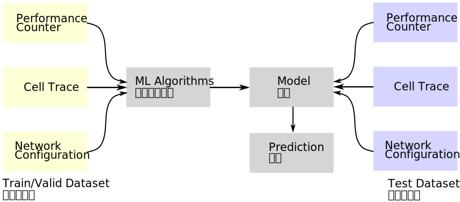
<figcaption> <small>流程示例</small> </figcaption>

## 通用流程

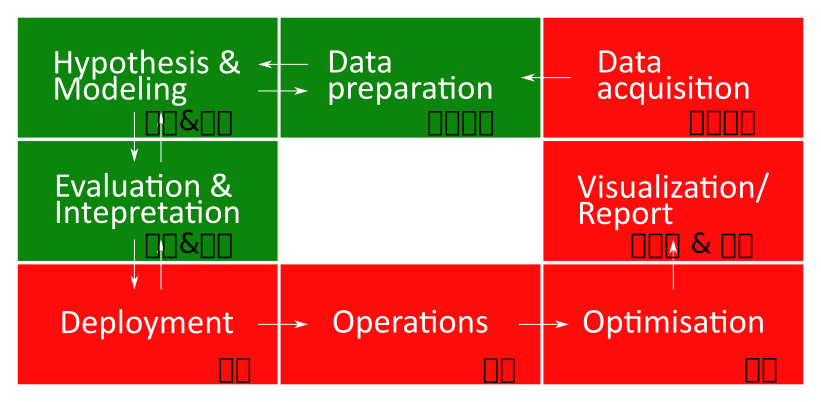
<figcaption> <small>通用流程 - 涉及机器学习模型创建周期的任务</small> </figcaption>

## 详细处理流程

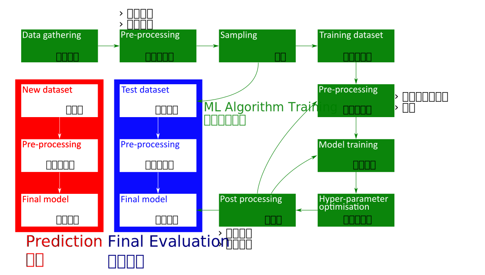

<figcaption> <small>细节学习过程</small> </figcaption>
<small>credit: Sabastian Raschka 2014 CC Creative Common Attributions^[Sabastian Raschka 2014 CC Creative Common Attributions] </small>

## 数据

- 数据采集 - 各种数据来源开源
      * <h4>可能会组合不同来源 </h4>
      * <h4>完善缺失的数据 </h4>
      * <h4>更清晰的模式 </h4>
      
- 数据预处理 - 丢失的数据，不一致的数值，分布变换


## 数据源

<div style = "float:left; width:100%">
 
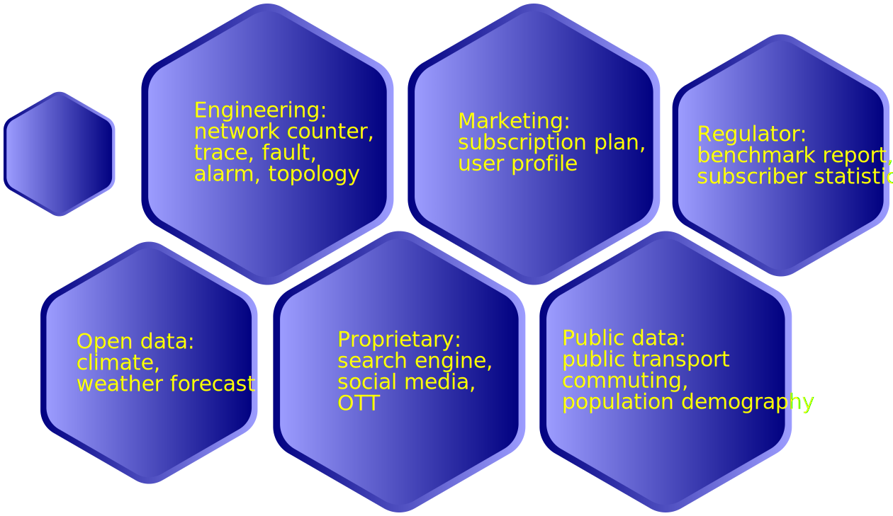
</div>
 
 


## 数据转换

```{r  echo = FALSE, error = FALSE, message = FALSE, warning = FALSE}
df_pop <-  read.csv("f:/Data/Machine_Learning/workshop/ML_ws_part2/slide_theory/pop_area.csv")

p <- plot_ly(data = df_pop, x = ~Population/100000000, y = ~Area..in.sq.mi./500000, type = 'scatter',
  mode = 'markers', symbol = 1, symbols = c('circle','x','o'),
  color = I('black'), marker = list(size = 10), name = "linear") %>%
  layout(
    xaxis = list(rangemode = "tozero", title = "Population x 100000000"),
    yaxis = list(range = c(0, 16), title = "Area x 500000 sq mile"))


p <- plot_ly(data = df_pop, x = ~Population/100000000, y = ~Area..in.sq.mi./500000, type = 'scatter',
  mode = 'markers', marker = list(size = 10, color = 'rgba(255, 182, 193, .7)', symbol = 'x'), name = "linear") %>%
  layout(
    xaxis = list(rangemode = "tozero", title = "Population x 100000000"),
    yaxis = list(range = c(0, 16), title = "Area x 500000 sq mile"))

plog <- plot_ly(data = df_pop, x = ~Population %>% log(), y = ~Area..in.sq.mi. %>% log(), type = 'scatter',
  mode = 'markers', marker = list(size = 10, color = 'rgba(0,0,128, .7)', symbol = 'hexagon'), name = "log") %>%
  layout(
    xaxis = list(rangemode = "tozero"),
    yaxis = list(range = c(0, 16)))
```

<div style = "float:left; width:60%">
 
```{r  echo = FALSE, error = FALSE, message = FALSE, warning = FALSE, fig.width = 8, fig.height = 5}

subplot(p, plog, titleX = T, titleY = T, margin = 0.04)
```

</div>
 
<div style = "float:right; width:40%">
<h6>- 数据转换：将数学函数应用于每个数据值</h6>
<h6>- 最常见的数据转换是单个变量的聚集和幅度变化</h6>
<h6>- 每个数据值首先按平均值减去，然后除以标准偏差</h6>
<h6>- 好处是更容易使用和更稳定</h6>
<h6>- 主要缺点是数据变得难以解释</h6>
<h6>- 简单函数;  $x^k$, $\sqrt{x}$, $\log(x)$, $e^x$, $\Vert x \Vert$ </h6>

</div>


# 机器学习的基本要点

## 要完成的任务

- 问题假设  

- 特征工程  

- 模特训练  

- 模型超参数优化  

- 性能评估


## 模型预测误差 

<div style = "float:left; width:60%">
 
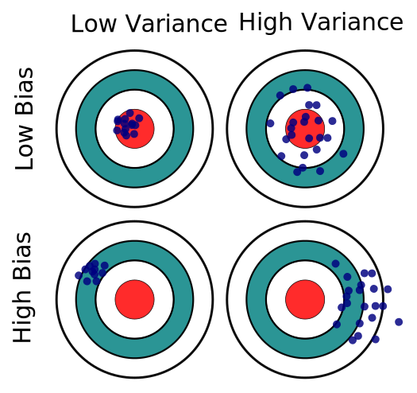
<figcaption><small>偏见和方差的图形牛眼图</small></figcaption>

</div>
 
<div style = "float:right; width:40%">
<small>

- 想象一下，目标的中心是一个完美预测正确值的模型

- 重复我们的整个模型构建过程，以获得目标上的一些单独的命中

- 了解不同的错误来源，以及如何导致偏差和方差，将有助于我们改进数据拟合过程，从而产生更准确的模型

归功于: Scott Fortmann-Roe,
http://scott.fortmann-roe.com/docs/BiasVariance.htm^[Scott Fortmann-Roe,
http://scott.fortmann-roe.com/docs/BiasVariance.htm] 

</small>
</div>

## 模型预测误差2

<div style = "float:left; width:50%">
- 偏差和方差测度在预测器中有2个不同的误差源。


- 数据点预测器的功能

$$\hat{\mathbf{\theta}}_m = g(x_{1}, ... , x_{m})$$

- 一个预测因子的偏见被定义为 

$$Bias(\hat{\mathbf{\theta}}_m) =  {\mathbb{E}\left[\hat{\mathbf{\theta}}_m\right]} - \mathbf{\theta}$$

- 我们希望的值和函数输出的真实值之间的差异

<small><small> Refer to Deep Learning; Ian Goodfellow, Yashua Bengio, and Aaron Courvill; chapter 5.4</small></small>
</div>
 
<div style = "float:right; width:50%">

- 一个预测器的方差被定义为
$$\mathrm{Var}[\hat{\theta}_m] = \sigma^{2} = \frac{\sum_{i=1}^{m} 
  \left(x_{i} - \bar{x}\right)^{2}}
  {m}$$

- 我们希望 作为数据样本的函数变化多少？

- 通过交叉验证能得到一种平衡。

- 或者使用均方误差（MSE）来评估

$$MSE = Bias(\hat{\mathbf{\theta}}_m)^2 + \mathrm{Var}[\hat{\theta}_m] $$


</div>

## 模型预测错误3

```{r echo = FALSE, error = FALSE, message = FALSE, warning = FALSE}

library(plotly)
library(ggplot2)


df_ml_cla <- data.frame(x=c(0,1,2,3,4,5,6,7,8,9), y=c(0,1,1.6,2.5,3.6,3.2,3.575,3.5,3.7,4))

x <- c(0,1,2,3,4,5,6,7,8,9)
y <- c(0,1,1.6,2.5,3.6,3.2,3.575,3.5,3.7,4)

#x1 <- c(0,1,2,3,4,5,6,7,8,9,1.5,2.5,3.5,4.5,5.5,6.5,7.5,8.5)
x1 <- c(0,1,1.5,2,2.5,3,3.5,4,4.5,5,5.5,6,6.5,7,7.5,8,8.5,9)
y1 <- c(0,1,1.4,1.6,2.3,2.5,2.8,3.6,3.1,3.2,3.5,3.575,3.45,3.5,3.75,3.7,3.9,4)


#we will make y the response variable and x the predictor
#the response variable is usually on the y-axis
#plot(x,y,pch=19)

#fit first degree polynomial equation:
fit  <- lm(y~x)
#second degree
fit2 <- lm(y~poly(x,2,raw=TRUE))
#third degree
fit3 <- lm(y~poly(x,3,raw=TRUE))
#fourth degree
fit4 <- lm(y~poly(x,4,raw=TRUE))
#eighth degree
fit8 <- lm(y~poly(x,8,raw=TRUE))

#eighth degree
fit8a <- lm(y1~poly(x1,8,raw=TRUE))
#generate range of 50 numbers starting from 30 and ending at 160
xx <- seq(0,9, length=50)
#plot(x,y,pch=19,ylim=c(0,5))
#lines(xx, predict(fit, data.frame(x=xx)), col="red")
#lines(xx, predict(fit2, data.frame(x=xx)), col="green")
#lines(xx, predict(fit3, data.frame(x=xx)), col="blue")
#lines(xx, predict(fit4, data.frame(x=xx)), col="purple")
#lines(xx, predict(fit8, data.frame(x=xx)), col="orange")

font1 <- list(
  family = "Courier New, monospace",
  size = 24,
  color = "#7f7f7f"
)

font2 <- list(
  size = 18,
  color = "#7f7f7f"
)
xlabel <- list(
  title = "Predictor",
  titlefont = font1,
  tickfont = font2
)
ylabel <- list(
  title = "Response",
  titlefont = font1,
  tickfont = font2
)

l <- list(
  font = list(
    family = "sans-serif",
    size = 16,
    color = "#000"),
  bgcolor = "#E2E2E2",
  bordercolor = "#FFFFFF",
  borderwidth = 2,
  x = 0.1, y = 0.9)

m <- list(l=50, r=50, b=50, t=10, pad=4)

p2d_cla <- plot_ly(hoverinfo = 'all') %>%

  add_trace(x=xx, y=predict(fit, data.frame(x=xx)), name = 'linear', type = 'scatter', mode = 'lines+markers', opacity = 0.5, marker = list(size = 10, color = 'rgba(0,0,128, .9)', symbol = 'hexagram-open')) %>%
  
  add_trace(x=xx, y=predict(fit3, data.frame(x=xx)), name = 'order 3', type = 'scatter', mode = 'lines+markers', opacity = 0.5, marker = list(size = 10, color = 'rgba(255,69,0, .9)', symbol = 'hexagon')) %>%
  
  add_trace(x=xx, y=predict(fit8, data.frame(x=xx)), name = 'order 8', type = 'scatter', mode = 'lines+markers', opacity = 0.5, marker = list(size = 10, color = 'rgba(0,128,0, .9)', symbol = 'octagon')) %>%  

  add_trace(x=xx, y=predict(fit8a, data.frame(x1=xx)), name = 'order 8x', type = 'scatter', mode = 'lines+markers', opacity = 0.5, marker = list(size = 10, color = 'rgba(255,0,0, .9)', symbol = 'pentagon')) %>%  
  
  add_trace(df_ml_cla, x = ~x, y = ~y, name = 'original', type = 'scatter', mode = 'markers', opacity = 1, marker = list(size = 10, color = 'rgba(255, 182, 193, .9)', line = list(color = 'rgba(152, 0, 0, .8)', width = 2), symbol = 'x')) %>% 

  add_trace(df_ml_cla, x = ~x1, y = ~y1, name = 'originalx', type = 'scatter', mode = 'markers', opacity = 1, marker = list(size = 10,color = 'rgba(102, 0, 51, .9)', line = list(color = 'rgba(255, 0, 127, .8)', width = 2), symbol = 'square-open-dot')) %>%  
  
  layout(xaxis = xlabel, yaxis = ylabel, margin = m, legend = l)
```


<div style = "float:left; width:85%">
 
```{r echo = F, fig.width =12, fig.height = 6.5}
p2d_cla
```

<small>评估模型偏差和方差</small>

</div>
 
<div style = "float:right; width: 15%">
<h6> - 给定一定数量的参数，模型参数控制过拟合，最优匹配，欠拟合 </h6>

</div>


## 模型预测错误4

```{r echo = FALSE, error = FALSE, message = FALSE, warning = FALSE}

library(plotly)
library(ggplot2)


df_ml_cla <- data.frame(x=c(0,1,2,3,4,5,6,7,8,9), y=c(0,1,1.6,2.5,3.6,3.2,3.575,3.5,3.7,4))

x <- c(0,1,2,3,4,5,6,7,8,9)
y <- c(0,1,1.6,2.5,3.6,3.2,3.575,3.5,3.7,4)
#we will make y the response variable and x the predictor
#the response variable is usually on the y-axis
#plot(x,y,pch=19)
#x1 <- c(0,1,2,3,4,5,6,7,8,9,1.5,2.5,3.5,4.5,5.5,6.5,7.5,8.5)
x1 <- c(0,1,1.5,2,2.5,3,3.5,4,4.5,5,5.5,6,6.5,7,7.5,8,8.5,9)
y1 <- c(0,1,1.4,1.6,2.3,2.5,2.8,3.6,3.1,3.2,3.5,3.575,3.45,3.5,3.75,3.7,3.9,4)


#we will make y the response variable and x the predictor
#the response variable is usually on the y-axis
#plot(x,y,pch=19)

#fit first degree polynomial equation:
fit  <- lm(y~x)
#second degree
fit2 <- lm(y~poly(x,2,raw=TRUE))
#third degree
fit3 <- lm(y~poly(x,3,raw=TRUE))
#fourth degree
fit4 <- lm(y~poly(x,4,raw=TRUE))
#eighth degree
fit8 <- lm(y~poly(x,8,raw=TRUE))

#eighth degree
fit8a <- lm(y1~poly(x1,8,raw=TRUE))
#generate range of 50 numbers starting from 30 and ending at 160
xx <- seq(0,9, length=50)
#plot(x,y,pch=19,ylim=c(0,5))
#lines(xx, predict(fit, data.frame(x=xx)), col="red")
#lines(xx, predict(fit2, data.frame(x=xx)), col="green")
#lines(xx, predict(fit3, data.frame(x=xx)), col="blue")
#lines(xx, predict(fit4, data.frame(x=xx)), col="purple")
#lines(xx, predict(fit8, data.frame(x=xx)), col="orange")

font1 <- list(
  family = "Courier New, monospace",
  size = 24,
  color = "#7f7f7f"
)

font2 <- list(
  size = 18,
  color = "#7f7f7f"
)
xlabel <- list(
  title = "Predictor",
  titlefont = font1,
  tickfont = font2
)
ylabel <- list(
  title = "Response",
  titlefont = font1,
  tickfont = font2
)

l <- list(
  font = list(
    family = "sans-serif",
    size = 16,
    color = "#000"),
  bgcolor = "#E2E2E2",
  bordercolor = "#FFFFFF",
  borderwidth = 2,
  x = 0.1, y = 0.9)

a <- list(
  x = 6,
  y = 0,
  text = "annotation a",
  xref = "x",
  yref = "y",
  showarrow = FALSE,
  arrowhead = 0,
  ax = 0,
  ay = 0
)

b <- list(
  x = 6,
  y = 0,
  text = "annotation b",
  xref = "x",
  yref = "y",
  showarrow = FALSE,
  arrowhead = 0,
  ax = 0,
  ay = 0
)

m <- list(l=50, r=50, b=50, t=10, pad=4)


######

p4 <-  plot_ly(df_ml_cla, x = ~x, y = ~y, name = 'original', type = 'scatter', mode = 'markers', opacity = 1, symbol = 1, marker = list(size = 10, color = 'rgba(255, 182, 193, .9)', line = list(color = 'rgba(152, 0, 0, .8)', width = 2), symbol = 'x'))

p1 <-  p4 %>% add_trace(x=xx, y=predict(fit, data.frame(x=xx)), name = 'linear', type = 'scatter', mode = 'lines+markers', opacity = 0.5, marker = list(size = 5, color = 'rgba(0,0,128, .9)', symbol = 'hexagram-open'))
  
p2 <-  p4 %>% add_trace(x=xx, y=predict(fit3, data.frame(x=xx)), name = 'order 3', type = 'scatter', mode = 'lines+markers', opacity = 0.5, marker = list(size = 5, color = 'rgba(255,69,0, .9)', symbol = 'hexagon'))
  
p3 <-  p4 %>% add_trace(x=xx, y=predict(fit8, data.frame(x=xx)), name = 'order 8', type = 'scatter', mode = 'lines+markers', opacity = 0.5, marker = list(size = 5, color = 'rgba(0,128,0, .9)', symbol = 'octagon'))  

p3a <- plot_ly(df_ml_cla, x = ~x1, y = ~y1, name = 'originalx', type = 'scatter', mode = 'markers', opacity = 1, marker = list(size = 10,color = 'rgba(102, 0, 51, .9)', line = list(color = 'rgba(255, 0, 127, .8)', width = 2), symbol = 'square-open-dot')) %>% add_trace(x=xx, y=predict(fit8a, data.frame(x1=xx)), name = 'order 8x', type = 'scatter', mode = 'lines+markers', opacity = 0.5, marker = list(size = 5, color = 'rgba(255,0,0, .9)', symbol = 'pentagon'))  


p5 <- subplot(p4, p1, p2, p3,nrows = 2, shareX = TRUE, shareY = TRUE) %>% layout(legend = list(x = 100, y = 0.5))

p5a <- subplot(p3,p3a,nrows = 2, shareX = TRUE, shareY = TRUE) %>% layout(legend = list(x = 100, y = 0.5))
#%>% layout(autosize = F, width = 1000, height = 500)


```

<div style = "float:left; width:85%">
 
```{r echo = F, fig.width =12, fig.height = 6.5}
p5
```

</div>
 
<div style = "float:right; width: 15%">
<h6> 从左上角开始, <br><br>(a) 原始数据   <br><br>(b) 欠拟合[高偏差]   <br><br>(c) 最适合   <br><br>(d) 过度拟合[高差异] </h6>

</div>

## 模型预测错误5

<div style = "float:left; width:85%">
 
```{r echo = F, fig.width =12, fig.height = 6.5}
p5a
```

</div>
 
<div style = "float:right; width: 15%">
<h6> - 对于同样的8阶多项式 </h6>
<h6> - （a）上图显示过拟合 <br> （b）下图通过更多的数据显示，下图是更加通用的模型</h6>


</div>

## 模型预测错误6

<div style = "float:left; width:50%">
- **偏差** - 是由于学习算法中的错误或过度简化的假设造成的错误

- 导致模型对于数据是欠拟合

- 使其难以有高预测精度  

- 很难将知识从训练集推广到测试集
</div>
 
<div style = "float:right; width:50%">

- **差异** - 是由于学习算法过于复杂导致

- 导致该算法对训练数据的变化非常敏感

- 导致模型对于数据而言过拟合

- 模型的训练数据携带太多噪声，对测试数据来说变得没有用

</div>

## 混淆矩阵（分类）

<div style = "float:left; width:60%">
 
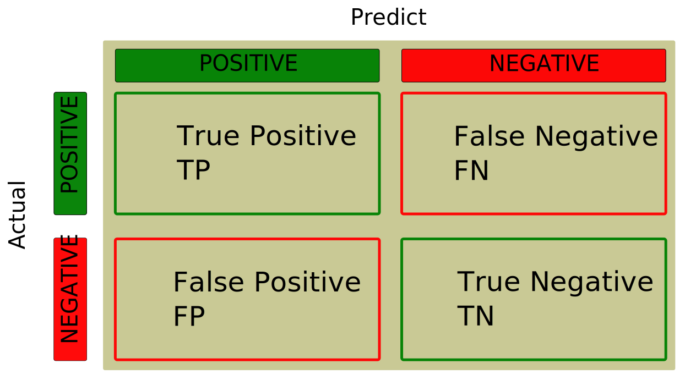
<figcaption><small>用于分类模型的混淆矩阵</small></figcaption>

</div>
 
<div style = "float:right; width:40%">
<h6>示例：分类垃圾邮件** 电子邮件</h6>

<h6>- TP: 已被反垃圾邮件过滤器阻止并符合垃圾邮件定义的邮件</h6>

<h6>- FP: 合法邮件错误地标记为垃圾邮</h6>  

<h6>- TN: 合法消息被正确标记为合法消息</h6>  

<h6>- FN: 垃圾邮件被错误地标记为合法信息</h6>

<small><small>** 未经请求的批量电子邮件</small> </small>


## 混淆矩阵（说明）

<div style = "float:left; width:50%">
 
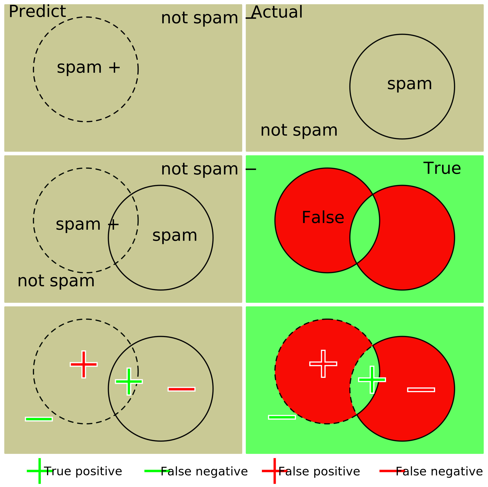
<figcaption><small>Confusion matrix for classfication model</small></figcaption>

</div>
 
<div style = "float:right; width:50%">


<h6>示例：分类垃圾邮件** 电子邮件</h6>

<h6>- TP: 已被反垃圾邮件过滤器阻止并符合垃圾邮件定义的邮件</h6>

<h6>- FP: 合法邮件错误地标记为垃圾邮</h6>  

<h6>- TN: 合法消息被正确标记为合法消息</h6>  

<h6>- FN: 垃圾邮件被错误地标记为合法信息</h6>

<small><small>** 未经请求的批量电子邮件</small> </small>


## 精密 和 召回（分类）

<div style = "float:left; width:60%">
 
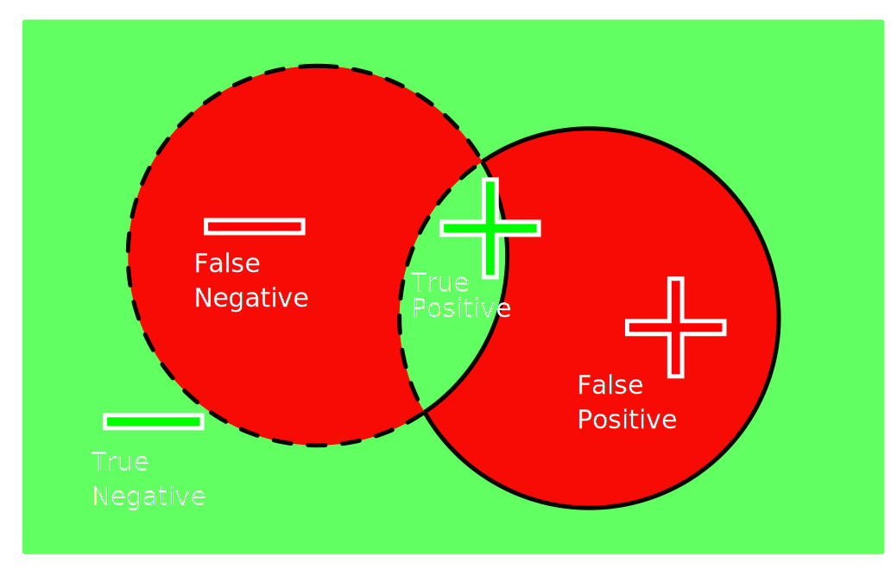
<figcaption><small>Accuracy, Precision & Recall</small></figcaption>

</div>
 
<div style = "float:right; width:40%">

<h6 align = left>- 精确,</h6>  
<small>$p = \frac{True\ Positive}{Predicted\ Positive}$</small><br>
<small>$$p = \frac{TP}{\left(TP + FP \right)}$$</small>


<h6 align = left>- 召回,</h6>  
<small>$p = \frac{True\ Positive}{Actual\ Positive}$</small><br>
<small>$$r = \frac{TP}{\left(TP + FN \right)}$$</small>


<h6 align = left>- 准确,</h6>  

<small>$$acc = \frac{\left(TP + TN\right)}{\left(TP + TN + FP + FN \right)}$$</small>


<h6 align = left>- F-措施,</h6>  

<small>$$F = \frac{2}{\left(\frac{1}{p} + \frac{1}{r} \right)}$$</small>


</div>


## 改进模式的策略（训练，交叉验证）

<div style = "float:left; width:80%">
 
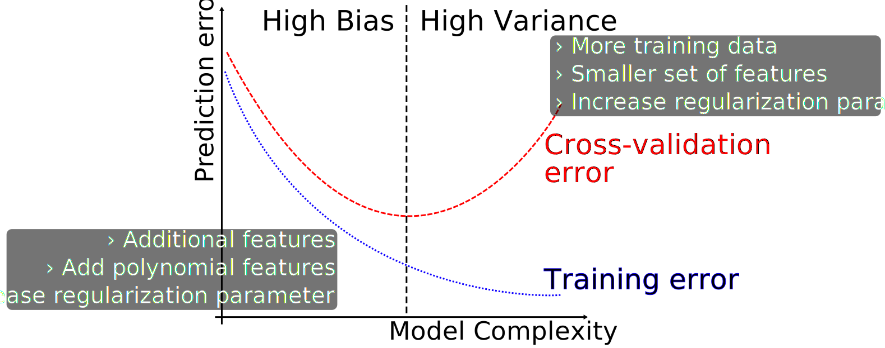


</div>
 
<div style = "float:right; width:20%">

<h6>- 对于一定数据量，训练和交叉评估的典型错误各不相同</h6>

<h6>- 如果数据是高偏差 - 更复杂的模型会降低误差如果数据高方差 - 更复杂的模型将会更多地错误（由于过度拟合），并且使用验证数据，性能不会很好</h6>

</div>


## 超参数优化

<div style = "float:left; width:70%">
 
超参数示例

- 随机森林:
      * <h4>树木数量，树木深度，采样率等<h4>
- 梯度升压机（GBM）:
      * <h4>树的数量，树的深度，学习速率，采样率等<h4>
- 深度学习:
      * <h4>激活函数，隐藏层数，隐藏层大小，L1，L2，退出率等<h4>


</div>
 
<div style = "float:right; width:30%">

</div>


## 优化技术

<div style = "float:left; width:60%">
 
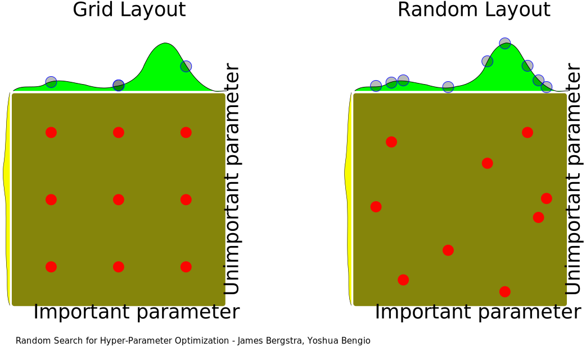
</div>
 
<div style = "float:right; width:40%">

<h6>- 手动搜索
    * 洞察超参数响应函数
    * 没有技术开销或障碍  </h6>
  
<h6>- 网格搜索
     * 执行简单
     * 在低维空间可靠  </h6>

<h6>- 随机搜索 </h6>


<small> 图1：用于优化函数f（x，y）= g（x）+ h（y）= g（x）的九个试验的网格和随机搜索，具有低有效维数。 在每个方格g（x）之上，以绿色显示，并且每个正方形h（y）的左侧以黄色显示。 通过网格搜索，九个试验仅在三个不同的地方测试g（x）。 随机搜索，所有九个试验探索不同的g值。 网格搜索的这种失败是高维超参数优化中的规则而不是异常。</small>

<small> http://www.jmlr.org/papers/volume13/bergstra12a/bergstra12a.pdf^[Random Search for Hyper-Parameter Optimization; http://www.jmlr.org/papers/volume13/bergstra12a/bergstra12a.pdf] </small>

</div>


## 激活功能

```{r echo = FALSE, error = FALSE, message = FALSE, warning = FALSE}

library(plotly)

x <- seq(-pi,pi,by=0.01)

y1 <- (exp(x)-exp(-x))/(exp(x)+exp(-x)) # Tanh

y2 <- ifelse(x<0,0,x) # Rectifier (ReLu)

y3 <- x # identity

y4 <- ifelse(x<0,0,1) # Step

y5 <- 1/(1+exp(-x)) # Logistic

y6 <- atan(x) # Arc Tan

y7 <- x/(1+abs(x)) # Softsign

y8 <- ifelse(x<0,0.01*x,x) # Leaky Rectifier (Leaky ReLu)

alpha <- 0.02

y9 <- ifelse(x<0,alpha*x,x) # Parameteric rectifier liner unit (PReLu)

y10 <- log((1+exp(x))) # SoftPlus

data <- data.frame(x, y1, y2, y3, y4, y5, y6, y7, y8, y9, y10)

p2 <- plot_ly(data, x = ~x, y = ~y1, name = 'Tanh', type = 'scatter', mode = 'lines') %>%
  add_trace(y = ~y2, name = 'Rectifier', mode = 'lines') %>% 
  add_trace(y = ~y3, name = 'Identity', mode = 'lines') %>% 
  add_trace(y = ~y4, name = 'Step', mode = 'lines') %>%   
  add_trace(y = ~y5, name = 'Logistic', mode = 'lines') %>%   
  add_trace(y = ~y6, name = 'Arc Tan', mode = 'lines') %>%  
  add_trace(y = ~y7, name = 'Softsign', mode = 'lines') %>% 
  add_trace(y = ~y8, name = 'Leaky ReLu', mode = 'lines') %>% 
  add_trace(y = ~y9, name = 'PReLu', mode = 'lines') %>% 
  add_trace(y = ~y10, name = 'SoftPlus', mode = 'lines') %>% 
  layout(
  title = "Neuron Activation Function", 
  xaxis = list(
    showgrid = TRUE, 
    title = "x", 
    zeroline = FALSE
  ), 
  yaxis = list(
    showline = FALSE, 
    title = "y"
  ),
  legend = list(x = 100, 
                y = 0.5, 
                font = list(family = "sans-serif",size = 28, color = "#000"))
)

```


<div style = "float:left; width:100%">
 
```{r echo = FALSE, error = FALSE, message = FALSE, warning = FALSE, fig.width = 12, fig.height = 7}
p2
```

<small> 激活功能 </small>


## 模型性能矩阵（误差）

<div style = "float:left; width:95%">
 
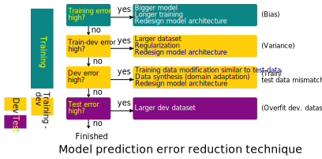
<figcaption><small>模型性能矩阵 - 误差分析流程</small></figcaption>

</div>
 
<div style = "float:right; width:5%">
<small>
<small>
归功于：百度的Andrew Ng的机器学习具体细节^[百度的Andrew Ng的机器学习具体细节]</small>
</small>
</div>


## 调试

```{r echo = FALSE, error = FALSE, message = FALSE, warning = FALSE}

library(plotly)
library(ggplot2)

df_ml2d <- read.csv("f:/Data/Machine_Learning/workshop/ML_difficult_2d_data.csv")

df_ml2d$x[which(df_ml2d$x == 5)] <- 'Correct'
df_ml2d$x[which(df_ml2d$x == 15)] <- 'Incorrect Base Case'
df_ml2d$x[which(df_ml2d$x == 25)] <- 'Incorrect Recursive Call'
df_ml2d$x[which(df_ml2d$x == 35)] <- 'Incorrect Seed Case'
df_ml2d$x <- as.factor(df_ml2d$x)

df_ml2d$y[which(df_ml2d$y == 5)] <- 'Correct'
df_ml2d$y[which(df_ml2d$y == 15)] <- 'Bug in Conditional Statement'
df_ml2d$y[which(df_ml2d$y == 25)] <- 'Bug in Recursive Function Call'
df_ml2d$y[which(df_ml2d$y == 35)] <- 'Bug in Recursive Computation'
df_ml2d$y <- as.factor(df_ml2d$y)

font1 <- list(
  family = "Courier New, monospace",
  size = 24,
  color = "#7f7f7f"
)

font2 <- list(
  size = 18,
  color = "#7f7f7f"
)
xlabel <- list(
  title = "Algorithm Correctness",
  titlefont = font1,
  tickfont = font2
)
ylabel <- list(
  title = "Bug in Implementation",
  titlefont = font1,
  tickfont = font2
)
m <- list(l=350, r=50, b=50, t=10, pad=4)

p2d <- plot_ly(df_ml2d, x = ~x, y = ~y, color = ~Code, colors = c('#BF382A', '#0C4B8E')) %>%  add_markers(sizes=c(30,30), size=10) %>%
  layout(xaxis = xlabel, yaxis = ylabel, autosize = F, width = 1200, height = 400, margin = m, legend = list(x = 100, y = 0.5))
         #%>% layout(margin=m)

```


<div style = "float:left; width:90%">
 
```{r echo = FALSE, error = FALSE, message = FALSE, warning = FALSE, fig.width = 8, fig.height = 6}
p2d
```

<small>http://ai.stanford.edu/~zayd/why-is-machine-learning-hard.html^[Why Machine Learning is Difficult; http://ai.stanford.edu/~zayd/why-is-machine-learning-hard.html]</small>
</div>
 
<div style = "float:right; width:10%">
<small>
<h6>- 相对困难的问题 </h6>
<h6>- 创造力，实验和韧性 </h6>
<h6>- 困难包括建立直觉 </h6>
<h6>- 算法或实现 </h6></small>


</div>


## 调试3D问题

```{r echo = FALSE, error = FALSE, message = FALSE, warning = FALSE}

library(plotly)
library(ggplot2)

df_ml <- read.csv("f:/Data/Machine_Learning/workshop/ML_difficult_data.csv")

df_ml$x[which(df_ml$x == 5)] <- 'Correct'
df_ml$x[which(df_ml$x == 15)] <- 'Non-optimal Learning Rate'
df_ml$x[which(df_ml$x == 25)] <- 'Incorrect Gradients'
df_ml$x <- as.factor(df_ml$x)

df_ml$y[which(df_ml$y == 5)] <- 'Correct'
df_ml$y[which(df_ml$y == 15)] <- 'Incorrect Gradient Computation'
df_ml$y[which(df_ml$y == 25)] <- 'Incorrect Feature Computation'
df_ml$y <- as.factor(df_ml$y)

df_ml$z[which(df_ml$z == 5)] <- 'Correct'
df_ml$z[which(df_ml$z == 15)] <- 'Overfitting (Too Complex'
df_ml$z[which(df_ml$z == 25)] <- 'Non-optimal Regularization'

font1 <- list(
  family = "Courier New, monospace",
  size = 16,
  color = "#7f7f7f"
)
xlabel3d <- list(
  title = "Algorithm Correctness",
  titlefont = font1
)
ylabel3d <- list(
  title = "Implementation Correctness",
  titlefont = font1
)
zlabel3d <- list(
  title = "Learning Model Issue",
  titlefont = font1
)

m <- list(l=50, r=50, b=50, t=10, pad=4)

p3d <- plot_ly(df_ml, x = ~x, y = ~y, z = ~z, color = ~Code, colors = c('#BF382A', '#0C4B8E')) %>%
  add_markers(sizes=c(10,10), size=10) %>%
  layout(scene = list(xaxis = xlabel3d,
                     yaxis = ylabel3d,
                     zaxis = zlabel3d), margin = m, legend = list(x = 100, y = 0.5))
```

<div style = "float:left; width:80%">
 

```{r echo = F, fig.width = 11, fig.height = 7}
p3d
```

</div>
 
<div style = "float:right; width:20%">
<small>
- 指数差错调试 <br><br>
- 算法或实现或超参数<br><br>
- 3D：实现，算法，模型<br><br>


<small>http://ai.stanford.edu/~zayd/why-is-machine-learning-hard.html</small>

</small>
```{r, echo = F, fig.width = 4, fig.height = 4}

```

</div>


## 机器调试 - 1

<div style = "float:left; width:70%">

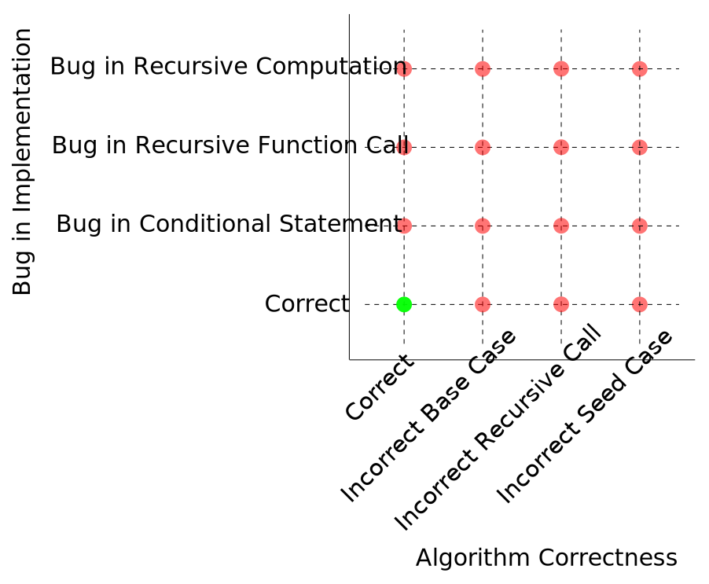

</div>
 
<div style = "float:right; width:30%">

<h6> 实现与算法 </h6>

<h6>- 相对困难的问题 </h6>
<h6>- 创造力，实验和韧性 </h6>
<h6>- 困难包括建立直觉 </h6>
<h6>- 算法或实现 </h6>

<small>http://ai.stanford.edu/~zayd/why-is-machine-learning-hard.html</small>

</div>


## 机器调试 - 2

<div style = "float:left; width:80%">

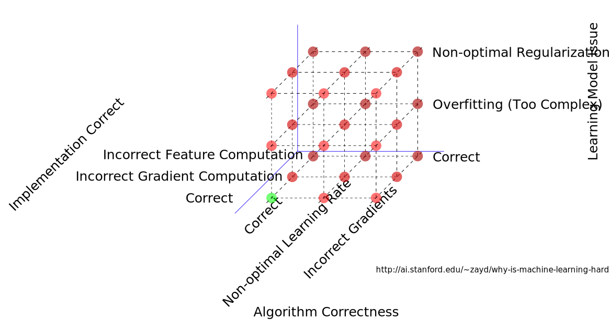

</div>
 
<div style = "float:right; width:20%">

<h6> 实现，算法和模型 </h6>

<h6>- 指数困难的调试 </h6>
<h6>- 算法或实现或超参数 </h6>


<small>http://ai.stanford.edu/~zayd/why-is-machine-learning-hard.html</small>
</div>


## 机器调试 - 3

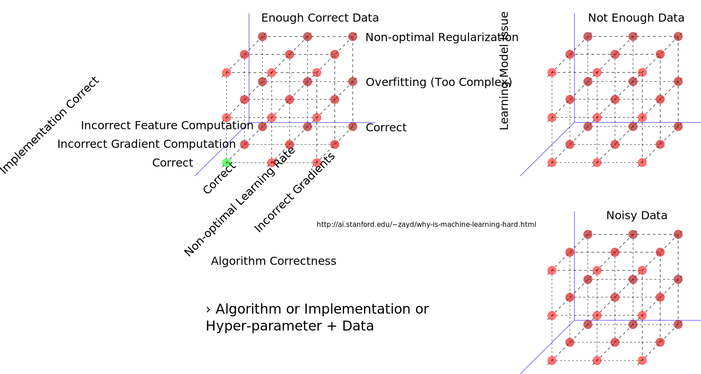
<figcaption><small>实现，算法，模型和数据</small></figcaption>
<small>http://ai.stanford.edu/~zayd/why-is-machine-learning-hard.html</small>

## 用例速度预测

<div style = "float:left; width:60%">
 
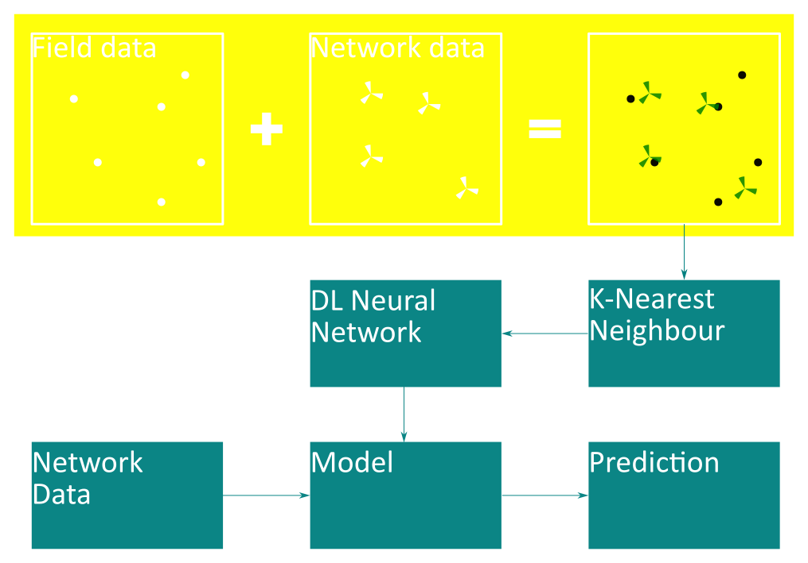
</div>
 
<div style = "float:right; width:40%">
<h6> 基于网络统计计数器数据建立用户体验预测</h6>

<h6>- 开放数据：政府机关运营商基准数据 </h6>
<h6>- 运营商数据：eNodeB统计计数器 </h6>
<h6>- 运营商数据：网络拓扑和配置</h6>

</div>


<figcaption><small></small></figcaption>


# 机器学习的概要


## 重点


<figcaption> <small>机器学习系统 - 辅助组件起主要作用</small> </figcaption>

<small> 机器学习系统隐藏的技术债务，NIPS 2015 - Google; https://papers.nips.cc/paper/5656-hidden-technical-debt-in-machine-learning-systems.pdf^[Hidden 机器学习系统隐藏的技术债务，NIPS 2015 - Google; https://papers.nips.cc/paper/5656-hidden-technical-debt-in-machine-learning-systems.pdf]</small>


## 关键


<div style = "float:left; width:60%">

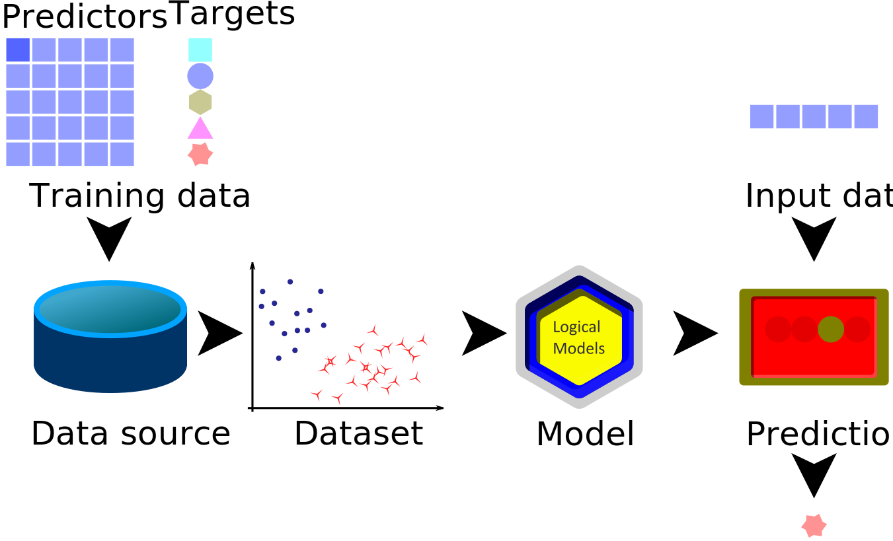
<figcaption><small>Key stage of machine learning</small></figcaption>
</div>
 
<div style = "float:right; width:40%">
- 知道你的数据
- 对开放数据充满信心
- 算法选择取决于任务目标
- 假设和评估标准
- 解决模型过拟合/不合适的技术
- 超参数搜索和优化
- 需要获得很多细节
</div>


## 困难(重述)

<div class='left' style='float:left;width:50%'>
- <p class="fragment highlight-blue">数据质量  </p>
      * <h4>噪声，错误，偏差</h4>
- <p class="fragment highlight-green">特征工程</p>
      * <h4>描述输出的属性 </h4>
- 算法选择
      * <h4>受限于预期的输出和可用的数据 </h4>
</div>
<div class='right' style='float:right;width:50%'>
- 学习  
      * <h4>时间和基础设施 </h4> 
- 模型复杂性  
      * <h4>准确性，时间和复杂性 </h4>
- 超参数 
      * <h4>迭代搜索找到最优参数 </h4>
</div>


## Open source that makes this possible
- slide with reveal.js in rmarkdown
- graphic with inkscape 
- chart with plotly  & ggplot in R 
	
<small>? Reserved the rights to be wrong</small>

## End

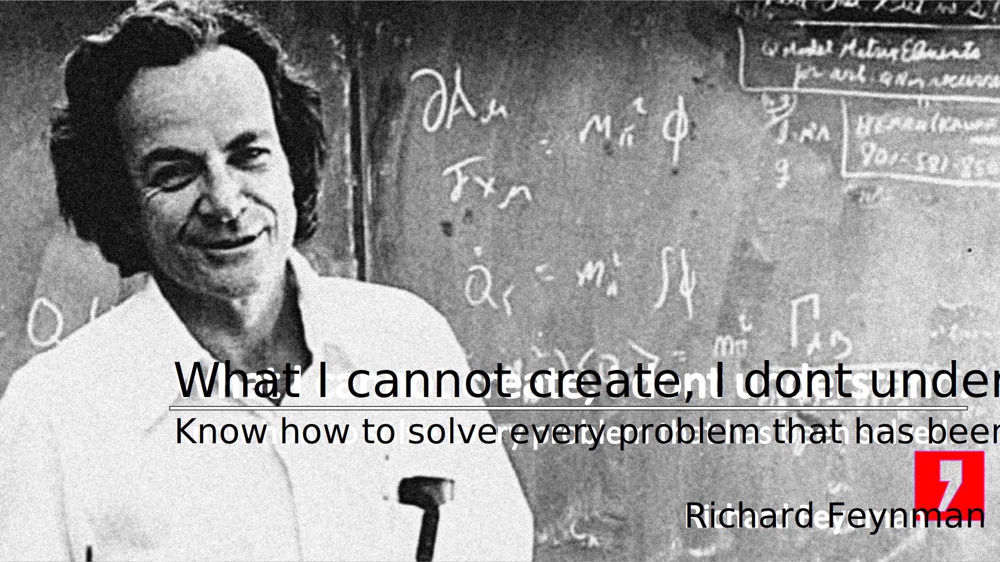


# 参考

